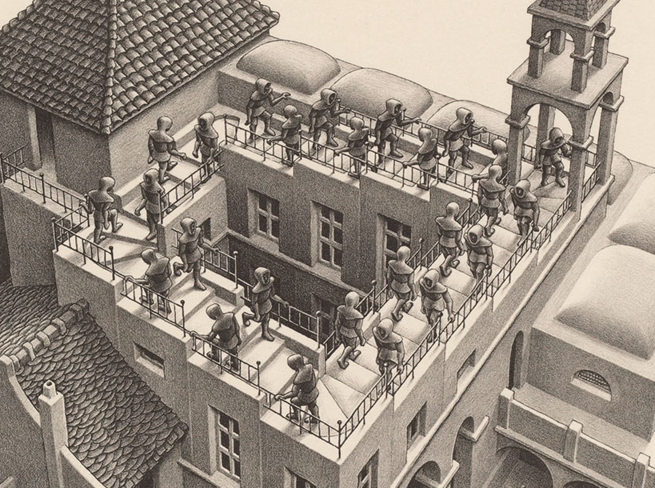

+++
title = "logical manifolds"
draft = false
date = 2021-11-01
+++

**logical manifold** is a concept which may prove useful in nuanced debates. to explain it,
I need to shortly cover [topological manifolds](https://en.wikipedia.org/wiki/Topological_manifold).

a *topo*logical manifold is a structure that looks 'flat' or 'straight' (euclidean) when
viewed from a small distance but may not be euclidean as a whole.

think of the Escher's stairs, a three‑dimensional manifold:

[source](https://www.escherinhetpaleis.nl/escher-today/ascending-and-descending/?lang=en)

look closely at each step in the picture. they all look typical, even boring. what's weird
is that you could not construct such staircase, despite there being nothing wrong with
any particular part. the staircase is **locally euclidean**.

now back to logical manifolds.

**a logical manifold is a statement which lays out a seemingly logical argumentation but
is wrong as a whole.**

whether a statement is a logical manifold is subjective. it may also change
over time, so it's not useful to categorize arguments in this way. rather, it is
a description of the recipient's relation towards the statement. they may
feel that something is off but be unable to point out big flaws in any of the intermediate
*steps*. in this respect, **a logical manifold is locally logical.**
