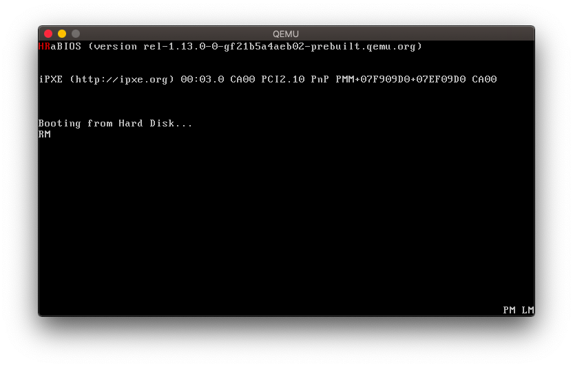

+++
title = "Low level stuff pt. 1 - Booting to 'Hello Rust!'"
date = 2020-07-17
+++

## Intro

This post is about how I booted to bare metal Rust on x86_64. My goal is to describe my learning path and hopefully get you interested in things I talk about. I'll be very happy if you find this content useful. Note that I'm a beginner and I may be wrong about many things. If you want to learn more, I'll put links to many resources. You can find all the code in my repo.

## The boot process

The inspiration for this project came from many sources. I think I first discovered [cfenollosa/os-tutorial](https://github.com/cfenollosa/os-tutorial). I also read a few chapters from [Writing a Simple Operating System - from Scratch](https://www.cs.bham.ac.uk/%7Eexr/lectures/opsys/10_11/lectures/os-dev.pdf). It's a good introduction to OS dev and related topics. First part of the tutorial is about bootloaders. To get a grasp of what it's all about, I just read every part of the tutorial and tried to write the Assembly code by myself.

Here's a brief explanation of the boot process and what you have to do at each stage. First the CPU thinks it's an Intel 8086 model from 1970s IIRC. This stage is called Real Mode. You have ~1MiB of memory and 16-bit [registers](https://en.wikipedia.org/wiki/Processor_register) at your disposition. In RM you are very limited. However, at this stage you can use BIOS routines (or interrupts). They're like an external library you can use to print a character on the screen, read from and write to hard disk etc. You can obviously do these things in other modes but you have to implement it yourself or do some hacking to use the interrupts.

When you're done with RM, you can switch to Protected Mode. In PM the address space is extended (you can access more memory), 32-bit registers are enabled and addressing works a bit different. To switch to PM, you have to set up a [Descriptor Table](http://www.osdever.net/tutorials/view/the-world-of-protected-mode) which is a piece of data that tells the CPU how to interpret addresses, and describes the characteristics of particular parts of the memory.

Note: At first I thought that in PM address like ds:ebx works just like in RM - ds is the segment (in 'data' memory if you want to read/write to it or in 'code' memory if you jump to it) and ebx is the offset in this segment. In reality ds acts like an index into the descriptor table. Then, the selected descriptor is used to translate the offset from the segment base (stored in `ebx`) to a physical address. You can read more about addressing in PM [here](http://ece-research.unm.edu/jimp/310/slides/micro_arch2.html). Also check out other stuff on [their website](http://ece-research.unm.edu/jimp/).


## Extending the bootloader - loading the second stage.

The bootloader is a very short piece of code - it's just 512 bytes long. I once even ran out of space and had to remove some strings and unnecessary code. The actual purpose of the bootloader is to load and run some other code. The book suggested booting to PM and jumping to a 32-bit kernel written in C. I didn't really like programming in C and at this point I lost my motivation.

Another time I learned about [Philipp Oppermann's blog](https://os.phil-opp.com/) on OS dev in Rust. I highly recommend it. I got really excited but, unfortunately for me, Oppermann uses GRUB (a kind of bootloader) relies on [bootimage](https://github.com/rust-osdev/bootimage) and [bootloader](https://github.com/rust-osdev/bootloader) crates to create a bootable image so I decided to come back to the tutorial after finishing my own bootloader. At that time booting to a program written in language other than Assembly and compiled to a separate file was way beyond my capabilities so I left the project for a while.

A couple weeks ago I got motivated enough to try to boot to a Rust program. My plan was to switch to Long Mode. Then I could either run a 64-bit kernel or load a second stage bootloader. Second stage bootloader is not limited to one sector (can be more than 512 bytes long) and can be 32-bit or even 64-bit so it has access to a larger address space and can load arbitrarily large files from disk to memory (as long as you implement it). Its purpose is to load larger kernels.

The first step was loading my program from hard disk to memory. I took a naive approach. I compiled the bootloader and my program. I concatenated both binaries together, one right after the other, to form one file, like this:

```bash
cat bootloader.bin hello_rust.bin > img
```

I didn't care if I could actually execute Rust code, I just wanted to test if I can load it. I added necessary code to my bootloader and ran the emulator. Unfortunately QEMU just kept restarting. I'm not sure what went wrong but it didn't matter since it was a stupid way to do it. I could just test loading data from the disk on a much simpler bootloader. I first tried to write it myself but after a while I just grabbed some code from Stack Overflow and added a simple error message in case the BIOS routine failed. After a couple of tries I finally managed to create a two-stage bootloader in a single Assembly program. It worked something like this:

```asm
org 0x7c00
first_stage:
    ; load second stage.

    ; `dl` register specifies which disk to load
    ; data from. it is set by the CPU to the same device
    ; the bootloader was loaded from.

    ; set `es` to 0x7e0 and `bx` to 0x0.

    ; the routine will load data to `(es << 4) | bx`
    ; or 0x7e00.
    mov ax, 0x7e0
    mov es, ax
    mov bx, 0x0

    mov al, 0x1 ; # of sectors to read.

    push ax ; store `al` for later.

    ; specify where the data is stored on the disk.
    mov ch, 0x0 ; cylinder.
    mov dh, 0x0 ; head.
    mov cl, 0x2 ; sector right after bootloader.

    ; `int 0x13` with `ah` set to 0x2
    ; loads data from disk to memory.
    mov ah, 0x2
    int 0x13

    pop bx ; restore `al` to `bl`.

    ; check whether the number of sectors read is correct.
    cmp al, bl
    jne error

    jmp 0x7e00 ; jump to second stage.

error:
    ; print error message, then halt.
    jmp $

; fill the rest of the first sector with zeros.
; it's 510 and not 512 because the last two bytes
; are 0xaa and 0x55 - the 'magic' number.
times 510-($-$$) db 0
dw 0xaa55

second_stage:
    ; do something, then halt.
    jmp $

; padding to fill the rest of the second sector with zeros.
times 1024-($-$$) db 0
```

This way I didn't have to link multiple files and NASM managed the padding of sectors for me. The code correctly compiled to a single file which was exactly 1024 bytes long - two entire sectors.

You can also use `align 512` instead of `times 1024-($-$$)` to allow your code to be arbitrarily large. This could be useful if you wanted to program the second stage of your bootloader in Assembly.

Note: Don't assume that the registers are initialized with any particular value. It took me half an hour or so to realize that I didn't set some register correctly in such a simple piece of code. IIRC there are only two things you can be sure of - that the bootloader will be loaded to `0x7c00` and that the `dl` register points to the same device the bootloader has been loaded from.


## Long Mode

After I managed to load the second sector I wanted to replace the Assembly code with Rust code. To check whether I could execute it I needed to switch to Long Mode. That's because I had some problems with compiling Rust code to 32-bit and I ended up using the x86_64-unknown-none target triple, just like in Oppermann's tutorial.

Long Mode adds a new memory model (paging), and enables the use of 64-bit instructions and registers. Switching to LM requires setting up paging. I identity-mapped the first 2 MiB of memory which is enough for now. I think it can be modified later by my Rust program. I read the following guides on paging:

- [https://wiki.osdev.org/Setting_Up_Long_Mode#Setting_up_the_Paging](https://wiki.osdev.org/Setting_Up_Long_Mode#Setting_up_the_Paging)
- [https://wiki.osdev.org/Paging#Enabling](https://wiki.osdev.org/Paging#Enabling)
- [https://intermezzos.github.io/book/first-edition/transitioning-to-long-mode.html](https://intermezzos.github.io/book/first-edition/transitioning-to-long-mode.html)
- [http://ece-research.unm.edu/jimp/310/slides/micro_arch3.html](http://ece-research.unm.edu/jimp/310/slides/micro_arch3.html)
- [https://os.phil-opp.com/entering-longmode/](https://os.phil-opp.com/entering-longmode/)

There are also other things you have to do before switching to LM like checking cpuid instruction support and the highest instruction op code available.


## Gluing Assembly and Rust together

I figured that to execute Rust code I needed to glue it with the bootloader to create a single binary. In this step I encountered a few difficult problems:

To work correctly, the bootloader has to be stored in the first 512 bytes of the file. The last two bytes of this sector have to be `0xaa55`.
My Rust code should also be aligned with the sectors and fill up the last sector entirely. Of course I would fill it with some garbage values but they had to be there.
The bootloader has to know how long the Rust code is.
Both programs will be loaded at specific locations in the memory so I have to manage the offsets in addresses.
Linker seemed like a tool made for this. I've never used a linker before so I just read [`ld`'s documentation](https://ftp.gnu.org/old-gnu/Manuals/ld-2.9.1/html_node/ld_toc.html). Unfortunately, I got a bit confused. I didn't understand how the . operator worked in linker scripts. I also got something wrong about the `AT()` instruction. You can see the [thread](https://www.reddit.com/r/osdev/comments/hhd7uj/linking_bootloader_with_second_stage/) I started on Reddit.

Eventually I came up with such script:

```
SECTIONS {
    .boot 0x7c00 : {
        *(.boot.*);
    }

    .hello_rust 0x7e00 : {
        *(.rust.*);
        . = ALIGN(512);
    } = 0xdeadc0de

    SECOND_STAGE_LENGTH = ((. - ADDR(.hello_rust)) >> 9);
}
```

Notice that I put all sections beginning with `.boot` in the first 512 bytes and all sections beginning with `.rust` after `0x7e00`. In order to make it work I have to rename all sections in the ELF file emitted by `rustc` so that they all start with a prefix. I do it using `objcopy` (in some linkers this option is called `--prefix-sections`):

```bash
objcopy hello_rust.o hello_rust_prefixed.o --prefix-alloc-sections='.rust'
```

The there are two tricks in this script. The first one is that I align the end of the .rust section to the nearest sector boundary with `. = ALIGN(512)`. Then I fill the rest with some garbage using `= 0xdeadc0de`. The second trick is in the last line. The `SECOND_STAGE_LENGTH` variable tells the bootloader how many sectors the second stage occupies. The size of this section is divided by 512 = 2^9. Since I know that the end of this section is aligned with the boundaries of the sectors I can just shift it 9 bits to the right.

These solutions seem a bit hacky. In my understanding the location of a piece of code in an ELF file (most common target) doesn't matter. This is not the case with the bootloader since the code must be aligned to 512 bytes and there must be a magic number at the end of the first sector. I'm not sure if there's a problem with my lack of knowledge or linkers are just not suitable for such tasks.

Note: I still don't understand why I can't just 'unpack' whole files into sections `.boot` and `.hello_rust` like this:

```
SECTIONS {
    .boot 0x7c00 : {
        boot.o;
    }

    .hello_rust 0x7e00 : {
        hello_rust.o;
        . = ALIGN(512);
    } = 0xdeadc0de

    SECOND_STAGE_LENGTH = ((. - ADDR(.hello_rust)) >> 9);
}
```

The binary produced by the linker is not even 1024 bytes long and there's no `0xdeadc0de` at the end. After trying to run QEMU it just keeps rebooting over and over so I suspect there are many things wrong with this program. Unfortunately, I know almost nothing about linking so I can't tell you why it doesn't work.

There's another thing I don't get about linking. When I inspected `hello_rust.o` file there were many sections like `.relo`, `.symtab`, `.strtab`. The debug build has even more of them. I get it that they store useful information about the ELF. But in order to produce a binary I have to include each section in my script (otherwise the linker complains). Should I just write each sections's name? Where do I get the whole list of sections from? What if they change? I suppose I could just prefix them all like I did. But what if there are many files I want to link?


## Hello Rust!

The last part - the Rust program. So far it only prints HR on screen, in the top left corner. To set up the project and compile it properly I followed the instructions on Oppermann's blog.

main.rs looks like this:

```rust
#![no_std]
#![no_main]

use core::panic::PanicInfo;

#[panic_handler]
fn panic(_info: &PanicInfo) -> ! {
    loop {}
}

#[no_mangle]
pub extern "C" fn _start() -> ! {
    // print "HR" in the top left corner

    let mut vga: *mut u16 = 0xb8000 as *mut u16;
    // red on black
    let style = (0x0 << 4 | 0x4);
    unsafe {
        *vga = style << 8 | ('H' as u16 & 0xff);
        vga = vga.offset(1);
        *vga = style << 8 | ('R' as u16 & 0xff);
    }

    loop {}
}
```

I use `cargo-xbuild` (it allows you to compile the core library to a specified target) to emit an object file that would later be linked with my bootloader:

```bash
cargo xrustc --release -- --emit obj=hello_rust.o
```

I've heard you can also do it without cargo-xbuild but I haven't tested it:

```bash
cargo rustc -Z build-std=core -- --emit obj=hello_rust.o
```

Then I add the prefix to sections in hello_rust.o and link it with the bootloader:

```bash
# add prefix
objcopy hello_rust.o hello_rust_prefixed.o --prefix-alloc-sections='.rust'

# link
lld hello_rust_prefixed.o boot.o -T script.ld --oformat binary -o img.bin
```

Finally I run the emulator:

```bash
qemu-system-x86_64 -drive format=raw,file=img.bin
```

The result:



Thanks for reading!
